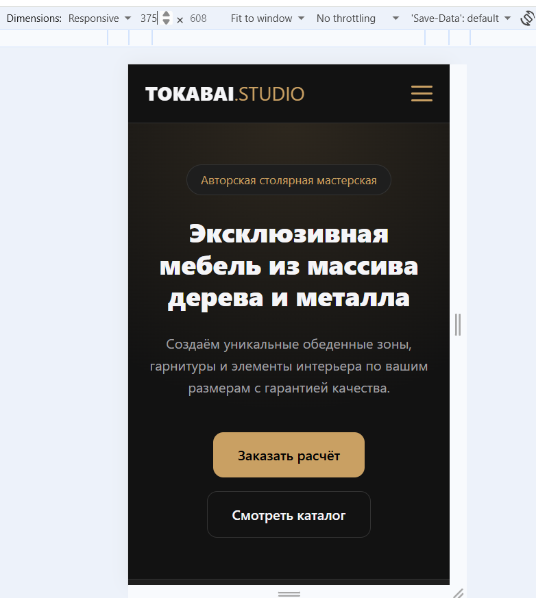
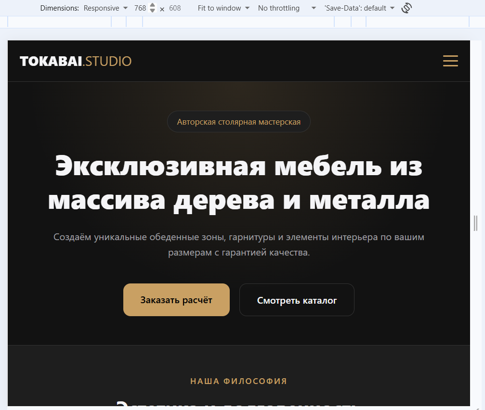
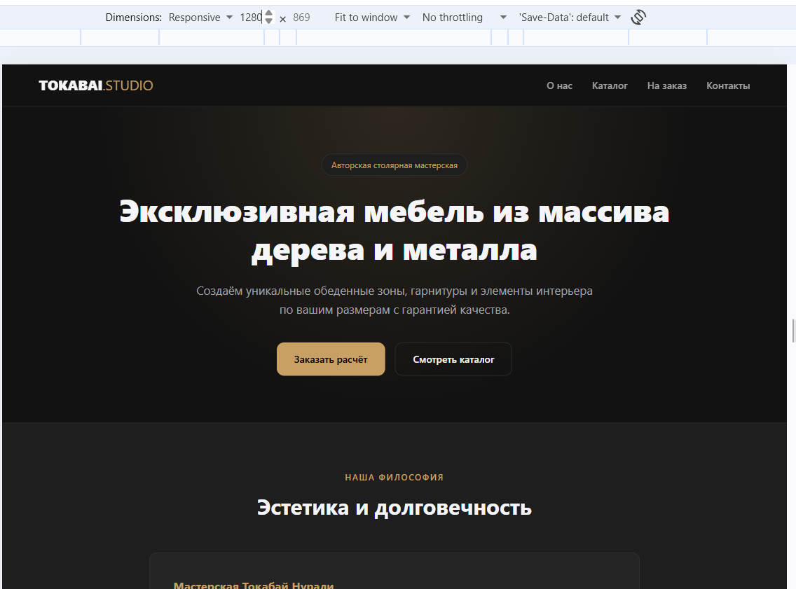

# Лендинг мастерской мебели Tokabai Studio (Лабораторная работа №3)

**Тема:** Мастерская мебели (каталог, изготовление на заказ, контакты)  
**Трек:** D — Современный чистый CSS  
**Репозиторий:** https://github.com/tokabai/landing-tokabai  
**Сайт (GitHub Pages):** https://tokabai.github.io/landing-tokabai/

---

## Что реализовано:
- **Семантика HTML5:** `header`, `nav`, `main`, `section`, `article`, `footer`.
- **Иерархия заголовков:** строго `h1` → `h2` → `h3`.
- **Инструменты Трека D:**
  1. **CSS Nesting (вложенность):** ровно как в Sass, нативный синтаксис браузеров без сборок.
  2. **`clamp()`:** плавное и откликивающееся вычисление размеров шрифтов (`--font-h1`, `--font-h2`) и отступов блоков.
  3. **CSS-переменные (`:root`):** палитра и темы оформления.
- **Адаптивность:** 3 диапазона ширин (до 600px, 600–1024px, от 1024px). Мобильное бургер-меню реализовано без JavaScript на CSS-чекбоксе.
- **Отсутствие горизонтального скролла:** все блоки и картинки отзывчивы.

---

## Почему этот инструмент (Современный чистый CSS):
Современный чистый CSS в 2026 году закрывает подавляющее большинство задач, ради которых раньше приходилось подключать тяжелые сборщики (Sass) или фреймворки (Bootstrap/Tailwind). Возможность использовать нативную вложенность (Nesting) улучшает читаемость кода и связность стилей без дополнительной компиляции. Функция `clamp()` решает проблему написания десятков громоздких медиа-запросов, обеспечивая плавную адаптивность типографики на любых разрешениях. Этот подход удобен тем, что проект не имеет внешних зависимостей, загружается максимально быстро и легко поддерживается. Единственный его минус по сравнению с Tailwind — необходимость писать имена классов вручную, однако чистая и структурированная разметка с избытком компенсирует это.

---

## Адаптив (Скриншоты)

- **375 px (Мобильный):**  
  

- **768 px (Планшет):**  
  

- **1280 px (Десктоп):**  
  

---

## Использование ИИ (AI Tools)
При выполнении работы использовался **Gemini** для генерации современного нативного CSS с использованием вложенности (`nesting`) и функций `clamp()`.
